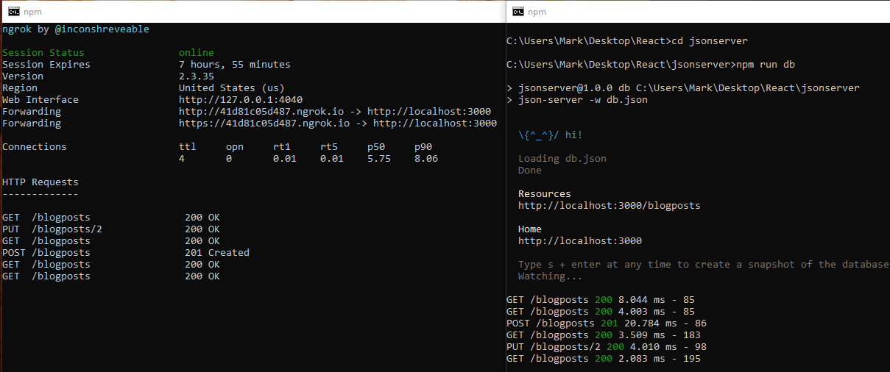

# React-Native-Blog

## About 
This is a mobile application that allows users to create and edit blog entries. In this app I wrote: GET, POST, and PUT functions to call to a custom API. I also utilized standard library functions that include: Callbacks, useReducer, and Context.

## Installation
I didn't make this app available as a snack on my Expo account because it wouldn't be much use to anyone anyways! You would ideally need to be running your own JSON server along with nGrok for hosting on your local machine. 
